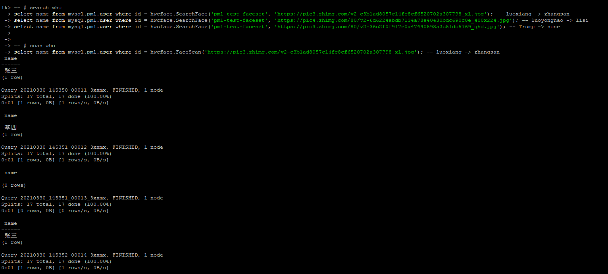
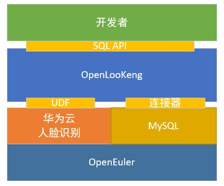
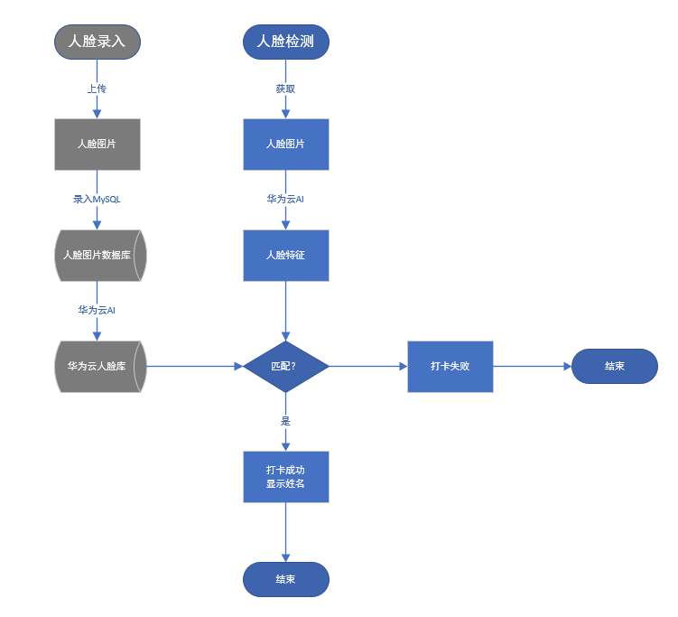
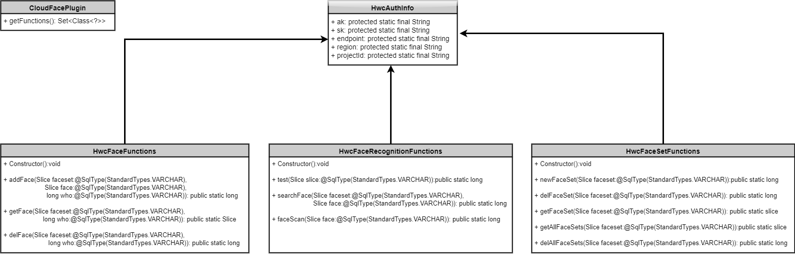

# 61-紫金山实验室-北京邮电大学小分队

<h2 id="intro">介绍</h2>

> TOPIC_ID: 61
> TEAM_ID:1269929257
> TEAM_NAME: 紫金山实验室-北京邮电大学小分队

模拟公司考勤打卡场景，利用华为云[人脸识别服务(FRS)](https://support.huaweicloud.com/face/index.html)和openLooKeng[用户自定义SQL函数(UDF)](https://openlookeng.io/zh-cn/docs/docs/develop/functions.html)，实现。

根据[题目描述](https://www.oschina.net/question/4469669_2319949)设计AddFaceSet, AddFace, DelFace, DelFaceSet等基础函数构建人脸库，据此设计SearchFace以及赛题要求FaceScan函数进行人脸识别，并以插件形式集成在openLooKeng服务器上，可以通过CLI进行查询，完成赛题要求。

<!-- <video controls>
    <source src="data/cloudface_demo_video.mp4" type="video/mp4">
    基于VMware虚拟机的项目展示视频(MySQL用户表构造+UDF插件实现+UDF函数使用)
</video> -->

> <div align="center"><a href="https://www.bilibili.com/video/BV18f4y1x7zx/"></a></div>
> 基于VMware虚拟机的项目展示视频(MySQL用户表构造+UDF插件实现+UDF函数使用)


## 方案设计

### 1.  系统架构



项目基于[openEuler](https://openeuler.org/zh/)操作系统，以UDF插件形式集成于[openLooKeng](https://openlookeng.io/)服务器，借此可连接MySQL数据库，统一处理和查询操作，为开发者用户提供简单但强大的SQL接口。

### 2. 业务流程



1. 人脸录入流程：管理员上传人脸图片，录入MySQL人脸数据库，经过华为云AI处理得到华为云人脸库；
2. 人脸检测流程：通过外部设备获取人脸图像，经华为云AI提取人脸特征，与华为云人脸库比对，若匹配则打卡成功，反之失败，流程结束。

## 安装教程

### 1. 安装openEuler

访问openEuler社区网站[下载](https://openeuler.org/zh/download/)对应镜像文件即可安装，详细步骤参考官方[安装指南](https://openeuler.org/zh/docs/20.03_LTS/docs/Installation/installation.html)。

本项目首先在VMware虚拟机上进行安装，后又迁移到[鹏城实验室](https://dw.pcl.ac.cn/)(❤)的云主机(openEuler-20.03-LTS)，用于最终demo展示。

### 2. 配置openEuler软件源

openEuler提供了多种repo源供用户在线使用，各repo源含义可参考系统安装，详见[开发环境准备](https://openeuler.org/en/docs/20.03_LTS/docs/ApplicationDev/preparation.html)

```
# pengchenglab's vm as an example
vi /etc/yum.repos.d/openEuler_<arch>.repo

    # fill in below
    [base]
    name=base
    baseurl=https://repo.openeuler.org/openEuler-20.03-LTS/everything/aarch64/
    enabled=1
    gpgcheck=0
    # end

# query version and arch of <baseurl> above
cat /etc/os-release
uname -a
# update repo
yum update
```

### 3. 安装准备

原始的openEuler操作系统缺乏一些实用工具, 需要先行安装.
```
yum install -y wget # openLooKeng自动部署需要下载工具
yum install -y tar # openLooKeng自动部署需要解压工具
yum install -y python # openLooKeng的启动需要Python环境
```

### 4. 安装openLooKeng

访问openLooKeng社区[安装文档](https://openlookeng.io/zh-cn/docs/docs/installation/deployment-auto.html)，选择[自动部署](https://openlookeng.io/zh-cn/docs/docs/installation/deployment-auto.html)方式 `bash <(wget -qO- https://download.openlookeng.io/install.sh)` 或 `bash <(wget -qO- https://download.openlookeng.io/install.sh)` 即可快速部署。自动部署失败可以选择[手动部署](https://openlookeng.io/zh-cn/docs/docs/installation/deployment.html)


### 5. 安装MySQL

安装过程略微复杂, 可参考社区[MySQL安装指南](https://openeuler.org/en/docs/20.03_LTS/docs/Administration/setting-up-the-database-server.html).

```
yum install -y mysql

# config mysql
mkdir -p /data/mysql && cd /data/mysql && mkdir data tmp run log
chown -R mysql:mysql /data
vi /etc/my.cnf

    # fill in below
    [mysqld_safe]
    log-error=/data/mysql/log/mysql.log
    pid-file=/data/mysql/run/mysqld.pid
    [mysqldump]
    quick
    [mysql]
    no-auto-rehash
    [client]
    default-character-set=utf8
    [mysqld]
    basedir=/usr/local/mysql
    socket=/data/mysql/run/mysql.sock
    tmpdir=/data/mysql/tmp
    datadir=/data/mysql/data
    default_authentication_plugin=mysql_native_password
    port=3306
    user=mysql
    # end

chown mysql:mysql /etc/my.cnf
echo 'alias mysql="mysql -S /data/mysql/run/mysql.sock"' >> /etc/profile
source /etc/profile

# initialize mysql
mysqld --defaults-file=/etc/my.cnf --initialize # attention to a temp passwd

# init with system
chmod 777 /usr/local/mysql/support-files/mysql.server
cp /usr/local/mysql/support-files/mysql.server /etc/init.d/mysql
su - mysql && service mysql start

# grant privilege
mysql -uroot -p <the temp passwd>
mysql> create user 'root'@'%' identified by 'root';
mysql> grant all privileges on *.* to 'root'@'%';flush privileges;
mysql> flush privileges;
```

### 6. 安装Maven

配置Maven工具, 可以根据源码打包, 便于开发维护.
```
# install maven
wget https://mirrors.tuna.tsinghua.edu.cn/apache/maven/maven-3/3.6.3/binaries/apache-maven-3.6.3-bin.tar.gz -P /tmp
sudo tar xzf /tmp/*maven*.tar.gz -C /opt
sudo ln -s /opt/apache-maven-3.6.3 /opt/maven

# config maven 
echo "export MAVEN_HOME=/opt/maven" >> /etc/profile
echo "export PATH=$MAVEN_HOME/bin:$PATH" >> /etc/profile
source /etc/profile
sudo chown -R openlkadmin:openlkadmin /opt/
mvn -version
```

### 7. 实现UDF

本项目采用编译模块后拷贝jar包到hetu-server/plugin目录下的方式实现UDF. 

```
su - openlkadmin

# config mysql connector
vim /opt/openlookeng/data/etc/catalog/mysql.properties 

    # fill in below
    connector.name=mysql
    connection-url=jdbc:mysql://localhost:3306
    connection-user=root
    connection-password=root
    # end

# install local huaweicloud-sdk-java-frs
cd /home/openlkadmin && git clone https://github.com/huaweicloud/huaweicloud-sdk-java-frs.git
mvn install:install-file \
   -Dfile=/home/openlkadmin/huaweicloud-sdk-java-frs/frs-sdk/target/frs-sdk-1.0.jar \
   -DgroupId=com.huaweicloud.frs \
   -DartifactId=frs-sdk \
   -Dversion=1.0 \
   -Dpackaging=jar \
   -DgeneratePom=true
   
mvn install:install-file \
   -Dfile=/home/openlkadmin/huaweicloud-sdk-java-frs/frs-sdk/lib/java-sdk-core-3.0.9.jar \
   -DgroupId=com.huawei \
   -DartifactId=java-sdk-core \
   -Dversion=3.0.9 \
   -Dpackaging=jar \
   -DgeneratePom=true


# download sources
git clone https://gitee.com/openlookeng/hetu-core.git && git checkout 1.0.1
git clone https://gitee.com/openeuler2020/team-1269929257.git
cp -r /home/openlkadmin/team-1269929257/hetu-cloudface/ /home/openlkadmin/hetu-core

# package from sources
cd /home/openlkadmin/hetu-core/hetu-cloudface && mvn clean && mvn package -e
ln -s /home/openlkadmin/hetu-core/hetu-cloudface/target/hetu-cloudface-1.0.1 /opt/openlookeng/hetu-server-1.0.1/plugin/cloudface
### ----------- OR ---------- ###
# use targer jar of repo
ln -s /home/openlkadmin/team-1269929257/hetu-cloudface/target/hetu-cloudface-1.0.1 /opt/openlookeng/hetu-server-1.0.1/plugin/cloudface

# restart hetu-server and open cli
bash /opt/openlookeng/bin/auxiliary_tools/launcher.sh restart
bash /opt/openlookeng/bin/openlk-cli
```


## 使用说明

### 1.  云主机展示
为提供可运行的demo, 本项目迁移到鹏城实验室的云主机上用于展示(`ssh openlkadmin@210.22.22.150 -p 3652 # usr:pwd = openlkadmin:olk || root:root`). 

云主机上已完成前述所有安装步骤, 可以直接使用. 使用步骤同[介绍](#intro)章节的展示视频.

### 2.  MySQL用户表构建

通过如下MySQL语句可以构建赛题要求的用户表, 代码仓库下的`scripts/creat_user_table.sql`也可以直接运行进行构建.

```sql
DROP DATABASE IF EXISTS pml;

create database pml charset utf8;
use pml;
create table user(`Id` int not null AUTO_INCREMENT primary key, `Name` varchar(20) NOT NULL, `FacePath` varchar(4096) NOT NULL);
insert into user (Id,Name,FacePath) values (1001,'张三','/home/openlkadmin/team-1269929257/data/luoxiang.jpg');
insert into user (Id,Name,FacePath) values (1002,'李四','/home/openlkadmin/team-1269929257/data/luoyonghao.jpg');
select * from user;

```

云主机上已经完成用户表的构建.

### 3.  UDF函数介绍



UDF函数定义在`hetu-cloudface/src/main/java/io/hetu/core/plugin/cloudface/`,分布在三个函数类（人脸库函数类、人脸函数类、人脸识别函数类）里面， 有如下函数签名.

```java
// 测试函数, 返回字符串长度
	@ScalarFunction("Test")
    @Description("Return length of input string")
    @SqlType(StandardTypes.INTEGER)
    public static long Test(@SqlType(StandardTypes.VARCHAR) Slice slice)
        
// 新建人脸库, 输入人脸库名字, 成功返回0, 失败返回-1
    @ScalarFunction("NewFaceSet")
    @Description("New a <para1: face_set>")
    @SqlType(StandardTypes.INTEGER)
    public static long NewFaceSet(@SqlType(StandardTypes.VARCHAR) Slice faceset)
        
// 向人脸库添加人脸, 输入人脸库名字,人脸存储路径,人脸对应数据库id, 成功返回0, 失败返回-1
    @ScalarFunction("AddFace")
    @Description("Add face in <para1: face_set> by <para2: face_path> and <para3: who_id>")
    @SqlType(StandardTypes.INTEGER)
    public static long AddFace(@SqlType(StandardTypes.VARCHAR) Slice faceset,
                               @SqlType(StandardTypes.VARCHAR) Slice face, @SqlType(StandardTypes.INTEGER) long who)
        
// 在人脸库中搜索人脸, 输入人脸库名字,人脸存储路径, 找到返回人脸对应id, 未找到返回0, 失败返回-1
    @ScalarFunction("SearchFace")
    @Description("Search face in <para1: face_set> by <para2: face_url>, return face_external_id or 0 for none")
    @SqlType(StandardTypes.INTEGER)
    public static long SearchFace(@SqlType(StandardTypes.VARCHAR) Slice faceset, @SqlType(StandardTypes.VARCHAR) Slice face)
        
// 在人脸库删除人脸, 输入人脸库名字,人脸对应数据库id, 成功返回0, 失败返回-1
    @ScalarFunction("DelFace")
    @Description("Delete face in <para1: face_set> by <para2: who_id>")
    @SqlType(StandardTypes.INTEGER)
    public static long DelFace(@SqlType(StandardTypes.VARCHAR) Slice faceset, @SqlType(StandardTypes.INTEGER) long who)
        
// 删除人脸库, 输入人脸库名字, 成功返回0, 失败返回-1
    @ScalarFunction("DelFaceSet")
    @Description("Delete a <para1: face_set>")
    @SqlType(StandardTypes.INTEGER)
    public static long DelFaceSet(@SqlType(StandardTypes.VARCHAR) Slice faceset)
        
// 在账户所属第一个人脸库中搜索人脸, 输入人脸网络URL, 找到返回人脸对应id, 未找到返回0, 失败返回-1
    @ScalarFunction("FaceScan")
    @Description("Scan <para1: face_url> in <implicit_para2: first_face_set>")
    @SqlType(StandardTypes.INTEGER)
    public static long FaceScan(@SqlType(StandardTypes.VARCHAR) Slice face)

```


### 4.  UDF函数使用

可以通过`cloudface.<FunctionName>`在openLooKeng CLI中调用对应函数, 每个函数的使用测试见`scripts/test_face_udf.sql`

```sql
-- # test cloudface
select cloudface.Test('return length of this string');

-- # new face set
select cloudface.NewFaceSet('pml-test-faceset');

-- # add faces
-- ## add zhangsan's face
select id, facepath FROM mysql.pml.user where name = '张三';
-- filling MANUALLY
select cloudface.AddFace('pml-test-faceset', '/home/openlkadmin/team-1269929257/data/luoxiang.jpg', 1001);
-- ## add zhangsan's face
select id, facepath FROM mysql.pml.user where name = '李四';
-- filling MANUALLY
select cloudface.AddFace('pml-test-faceset', '/home/openlkadmin/team-1269929257/data/luoyonghao.jpg', 1002);

-- # search who
select name from mysql.pml.user where id = cloudface.SearchFace('pml-test-faceset', 'https://pic3.zhimg.com/v2-c3b1ad8057c14fc8cf6520702a307798_xl.jpg'); -- luoxiang -> zhangsan
select name from mysql.pml.user where id = cloudface.SearchFace('pml-test-faceset', 'https://pic4.zhimg.com/80/v2-6d6224abdb7134a78e40430bdc690c0e_400x224.jpg'); -- luoyonghao -> lisi
select name from mysql.pml.user where id = cloudface.SearchFace('pml-test-faceset', 'https://pic3.zhimg.com/80/v2-36c2f0f917e0a47440593a2c51dc5769_qhd.jpg'); -- Trump -> none

-- # scan who
select name from mysql.pml.user where id = cloudface.FaceScan('https://pic3.zhimg.com/v2-c3b1ad8057c14fc8cf6520702a307798_xl.jpg'); -- luoxiang -> zhangsan

-- # delete face
select cloudface.DelFace('pml-test-faceset', 1001);

--# delete face set
select cloudface.DelFaceSet('pml-test-faceset');
```

云主机上保留有人脸库, 可以直接进行人脸识别, 会有如下结果.


## 特技

1. 完整的人脸识别接口
2. AI + SQL
3. 云主机展示


